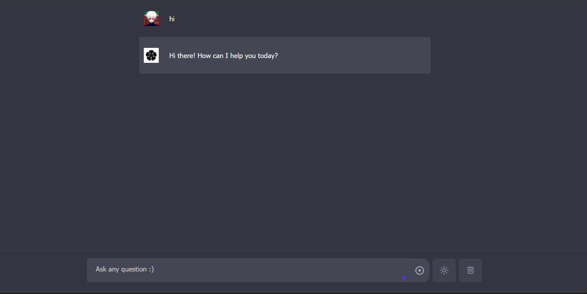
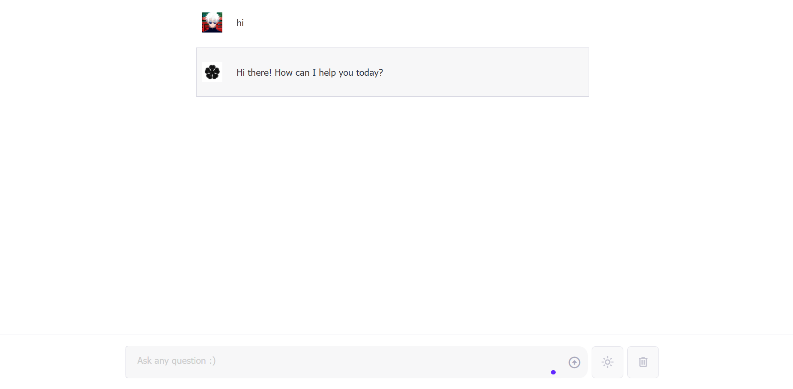

# ChatGPT Clone

<!-- Preview Images -->
<div align="center">
  
  
  <p><em>Left: Dark Mode | Right: Light Mode</em></p>
</div>

---

A modern, responsive ChatGPT clone that provides an intuitive chat interface for AI-powered conversations. This application replicates the core functionality of ChatGPT with a clean, responsive, user-friendly design supporting both dark and light themes.

##  Key Features

- **Real-time Chat Interface** - Seamless conversation experience with instant responses
- **Theme Toggle** - Switch between dark and light modes for optimal viewing comfort
- **Message History** - Persistent chat history throughout your session
- **Copy Messages** - One-click copy functionality for AI responses
- **Responsive Design** - Optimized for desktop, tablet, and mobile devices
- **Typing Indicators** - Visual feedback while AI is generating responses
- **Message Timestamps** - Track conversation timeline
- **Auto-scroll** - Automatic scrolling to latest messages
- **Markdown Support** - Rich text formatting in AI responses
- **Error Handling** - Graceful error management with user-friendly messages

## 🛠️ Technologies Used

### Frontend
- **HTML5** - Semantic markup structure
- **CSS3** - Modern styling 
- **Vanilla JavaScript** - Core functionality and DOM manipulation
- **CSS Variables** - Dynamic theming system

### AI Integration
- **Google Gemini API** - Powered by Google's advanced language model
- **Fetch API** - Modern HTTP client for API communication
- **JSON** - Data exchange format

### Design & UX
- **Material Design Icons** - Consistent iconography
- **Mobile-First Design** - Progressive enhancement approach

## 📋 Prerequisites

Before running this application, ensure you have:

- A modern web browser (Chrome, Firefox, Safari, Edge)
- A valid Google Gemini API key
- A local development server (optional but recommended)

## 🚀 Getting Started

### 1. Clone the Repository

```bash
git clone https://github.com/mibienpanjoe/ChatGpt-Clone.git
cd chatgpt-clone
```

### 2. Get Your Gemini API Key

1. Visit the [Google AI Studio](https://makersuite.google.com/app/apikey)
2. Sign in with your Google account
3. Click "Create API Key"
4. Copy your generated API key

### 3. Configure the Application

1. Open the `script.js` file in your text editor
2. Locate the API key configuration section at the top of the file:

```javascript
// Replace 'YOUR_API_KEY_HERE' with your actual Gemini API key
const API_KEY = 'YOUR_API_KEY_HERE';
```

3. Replace `'YOUR_API_KEY_HERE'` with your actual Gemini API key:

```javascript
const API_KEY = 'your-actual-gemini-api-key-goes-here';
```

### 4. File Opening
- Simply open `index.html` in your web browser
- Note: Some features may be limited due to CORS restrictions


## 💡 Usage Tips

- **Theme Toggle**: Click the theme button in the header to switch between dark and light modes
- **Copy Messages**: Click the copy icon next to any AI response to copy it to your clipboard  
- **Mobile Experience**: The interface is fully responsive - try it on your phone!
- **Long Conversations**: The chat automatically scrolls to show new messages
- **Keyboard Shortcuts**: Press Enter to send messages quickly


## 🎨 Customization

### Changing Colors
Edit the CSS variables in `style.css`:

```css
:root {
  --primary-color: #4285f4;
  --background-color: #ffffff;
  --text-color: #202124;
  /* Add your custom colors */
}
```

### Adding New Features
The modular JavaScript structure makes it easy to add new functionality:

```javascript
// Add your custom functions
function newFeature() {
  // Your code here
}
```

## 🤝 Contributing

Contributions are welcome! Please feel free to submit a Pull Request. For major changes, please open an issue first to discuss what you would like to change.

## 📄 License

This project is licensed under the MIT License - see the [LICENSE](LICENSE) file for details.

## ⚠️ Important Notes

- Keep your API key secure and never commit it to version control
- The Gemini API has usage limits - monitor your usage in Google AI Studio
- This is a demonstration project - add proper authentication for production use

## 📞 Support

If you encounter any issues:

1. Check that your API key is correctly configured
2. Ensure your internet connection is stable
3. Verify the API key has proper permissions
4. Open an issue on GitHub if problems persist

---

**Built by mj** 🚀